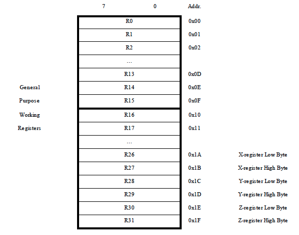

.. _memory:

Memory
******
The memory of the AVR is divided in 2 groups. On the one hand, we have program memory, where instructions are stored. That memory is about 16 bits of width. On the other hand, we have the data memory, where data is stored. That memory is about 8 bits of width. And the 32 first cells of memory are the registers. The first 16 registers are protected.

**Registers (Data Memory)**

Docstrings
**********
.. automodule:: memory
	:members:

